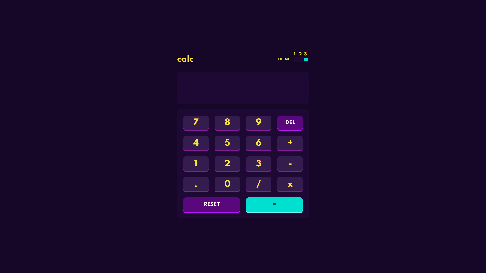

# Frontend Mentor - Calculator app solution

This is a solution to the [Calculator app challenge on Frontend Mentor](https://www.frontendmentor.io/challenges/calculator-app-9lteq5N29). Frontend Mentor challenges help you improve your coding skills by building realistic projects.

## Table of contents

- [Frontend Mentor - Calculator app solution](#frontend-mentor---calculator-app-solution)
  - [Table of contents](#table-of-contents)
  - [Overview](#overview)
    - [The challenge](#the-challenge)
    - [Screenshot](#screenshot)
    - [Links](#links)
  - [My process](#my-process)
    - [Built with](#built-with)
    - [What I learned](#what-i-learned)

**Note: Delete this note and update the table of contents based on what sections you keep.**

## Overview

### The challenge

Users should be able to:

- See the size of the elements adjust based on their device's screen size
- Perform mathmatical operations like addition, subtraction, multiplication, and division
- Adjust the color theme based on their preference
- **Bonus**: Have their initial theme preference checked using `prefers-color-scheme` and have any additional changes saved in the browser

### Screenshot



### Links

- Solution URL: [Solution](https://www.frontendmentor.io/solutions/calculator-app-built-using-react-styled-components-bFRoZIv4B)
- Live Site URL: [Live Site](https://hoangnguyen-react-calculator.netlify.app/)

## My process

### Built with

- CSS Grid
- [React](https://reactjs.org/) - JS library
- [Styled Components](https://styled-components.com/) - For styles

### What I learned

[useLayoutEffect](https://reactjs.org/docs/hooks-reference.html#uselayouteffect) hook:

Normally, the useEffect hook fires after a component is rendered, which makes a bad place to update the UI of the app. The useLayoutEffect hook fires before the render, allowing updates to be made to the UI before it is rendered. I used useLayoutEffect to load in the preferred theme from localStorage. This enables the UI to not flicker when the theme is changing.

```js
useLayoutEffect(() => {
  const savedTheme = parseInt(localStorage.getItem('theme'));
  if (savedTheme === 1) {
    setTheme1();
    setThemeNumber(1);
  }
  if (savedTheme === 2) {
    setTheme2();
    setThemeNumber(2);
  }
  if (savedTheme === 3) {
    setTheme3();
    setThemeNumber(3);
  }
}, []);
```
